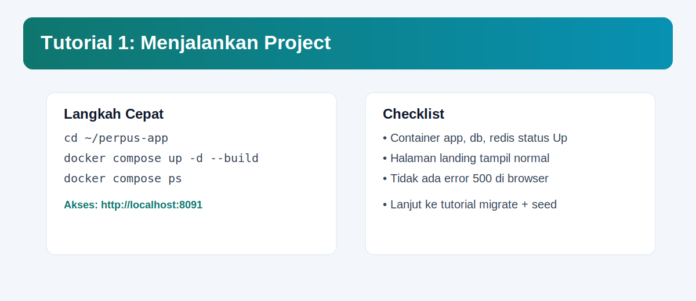
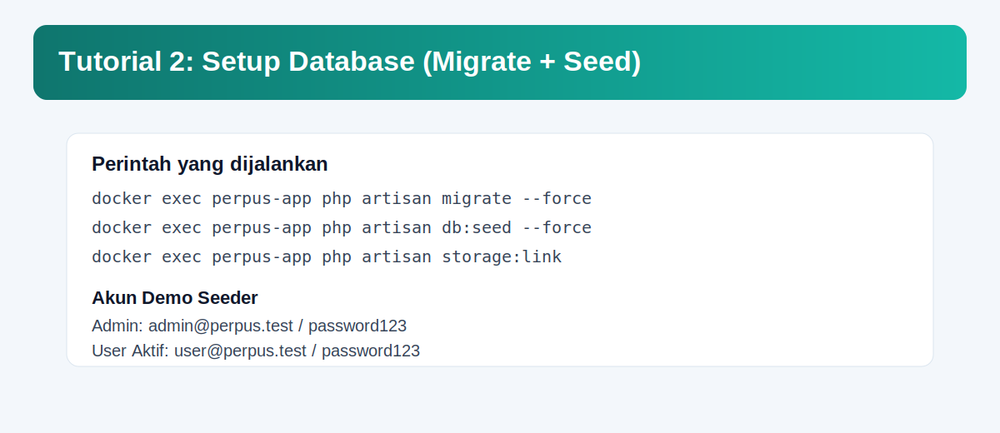
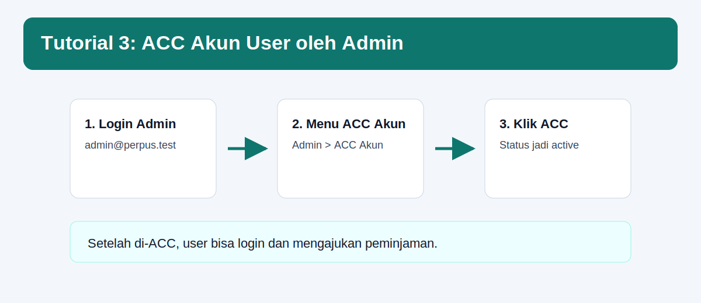
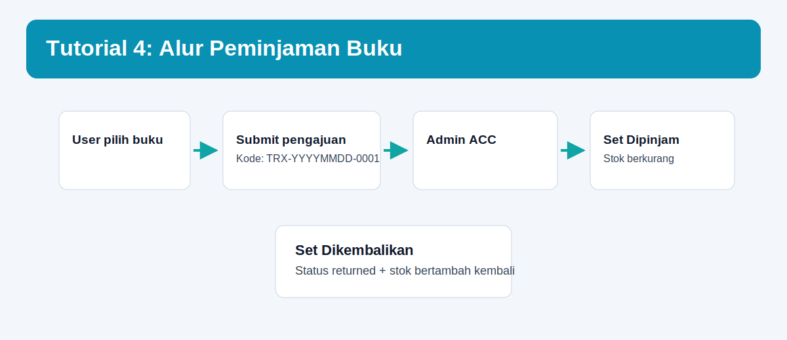

# Perpus App (Laravel)

Aplikasi perpustakaan berbasis Laravel dengan pemisahan area **Guest**, **User**, dan **Admin**.
Project ini sudah mendukung alur:

- register user -> status akun `pending`
- approval akun oleh admin
- user login setelah akun aktif
- pengajuan peminjaman buku
- admin proses `approve / reject / borrowed / returned`
- stok buku otomatis berkurang/bertambah

---

## Daftar Isi

1. [Fitur Utama](#fitur-utama)
2. [Teknologi](#teknologi)
3. [Struktur Folder](#struktur-folder)
4. [Quick Start (Docker)](#quick-start-docker)
5. [Akun Demo Seeder](#akun-demo-seeder)
6. [Tutorial Bergambar](#tutorial-bergambar)
7. [Alur Bisnis](#alur-bisnis)
8. [Perintah Penting](#perintah-penting)
9. [Troubleshooting](#troubleshooting)
10. [Catatan Pengembangan](#catatan-pengembangan)

---

## Fitur Utama

### Guest
- Landing page sederhana, modern, responsive.
- Lihat daftar buku + filter kategori + pencarian.
- Lihat detail buku.

### User
- Register akun (status default `pending`).
- Login hanya jika akun sudah `active`.
- Ajukan peminjaman buku.
- Kode transaksi otomatis (format: `TRX-YYYYMMDD-0001`).
- Tanggal pinjam otomatis hari ini, tanggal kembali otomatis +7 hari.
- Riwayat peminjaman + detail transaksi sendiri.

### Admin
- Dashboard statistik.
- Kelola buku (CRUD + upload cover).
- Kelola kategori (CRUD).
- ACC akun user (`approve`, `reject`, `deactivate`, re-activate).
- Proses pengajuan peminjaman:
  - approve
  - reject
  - set dipinjam
  - set dikembalikan

### Validasi Bisnis
- User nonaktif tidak bisa login.
- User tidak bisa pinjam judul yang sama jika masih aktif (`pending/approved/borrowed`).
- Buku stok 0 tidak bisa dipinjam.
- Saat `returned`, stok buku bertambah otomatis.

---

## Teknologi

- Laravel 12
- PHP 8.2+
- MySQL 8
- Redis 7
- Blade + Bootstrap 5
- Docker + Docker Compose

---

## Struktur Folder

```bash
perpus-app/
├── app/
│   ├── Http/
│   │   ├── Controllers/
│   │   │   ├── Admin/
│   │   │   └── User/
│   │   └── Middleware/
│   ├── Models/
│   └── Services/
├── database/
│   ├── migrations/
│   └── seeders/
├── resources/views/
│   ├── layouts/
│   ├── components/
│   ├── auth/
│   ├── landing/
│   ├── user/
│   └── admin/
├── routes/web.php
├── docker-compose.yml
└── README.md
```

---

## Quick Start (Docker)

### 1) Jalankan container

```bash
cd ~/perpus-app
docker compose up -d --build
```

### 2) Jalankan migration + seeder

```bash
docker exec perpus-app php artisan migrate --force
docker exec perpus-app php artisan db:seed --force
docker exec perpus-app php artisan storage:link
```

### 3) Buka aplikasi

- `http://localhost:8091`

---

## Akun Demo Seeder

Setelah `db:seed`, akun default:

- Admin: `admin@perpus.test` / `password123`
- User aktif: `user@perpus.test` / `password123`
- User pending: `pending@perpus.test` / `password123`

> Jika sebelumnya database Anda sudah berisi data lama, akun login bisa berbeda.
> Cek dengan query SQL atau jalankan `migrate:fresh --seed` jika ingin benar-benar ulang dari nol.

---

## Tutorial Bergambar

### 1. Start project



### 2. Migrate + seed



### 3. ACC akun user



### 4. Alur peminjaman



### 5. Peta akses role


---

## Alur Bisnis

### Register -> Pending -> ACC Admin -> Login
1. User register.
2. Sistem simpan `status_akun = pending`.
3. Admin buka menu `ACC Akun`.
4. Admin klik `ACC`.
5. User bisa login.

### Pengajuan Peminjaman
1. User memilih buku.
2. Sistem generate kode transaksi otomatis.
3. Pengajuan masuk status `pending`.
4. Admin review dan approve/reject.

### Dipinjam -> Dikembalikan
1. Admin set transaksi ke `borrowed` (stok berkurang).
2. Saat buku kembali, admin set ke `returned` (stok bertambah).

---

## Perintah Penting

```bash
# Cek container
docker compose ps

# Cek log app
docker logs -f perpus-app

# Cek route
docker exec perpus-app php artisan route:list

# Cek status migration
docker exec perpus-app php artisan migrate:status

# Clear cache
docker exec perpus-app php artisan optimize:clear

# Re-seed data
docker exec perpus-app php artisan db:seed --force
```

---

## Deploy ke Vercel

Project ini adalah Laravel full-stack, jadi Vercel perlu entrypoint PHP dan build asset Vite.
Konfigurasi dasar untuk itu sudah disiapkan lewat:

- `vercel.json`
- `api/index.php`
- script Composer `vercel`

### Environment variable minimal di Vercel

Isi variable berikut di dashboard Vercel:

- `APP_KEY`
- `APP_URL`
- `DB_CONNECTION`
- `DB_HOST`
- `DB_PORT`
- `DB_DATABASE`
- `DB_USERNAME`
- `DB_PASSWORD`

Disarankan juga:

- `LOG_CHANNEL=stderr`
- `CACHE_STORE=array`
- `SESSION_DRIVER=cookie`
- `QUEUE_CONNECTION=sync`

### Catatan penting

- Migration database jangan dijalankan otomatis di build. Jalankan manual ke database production Anda.
- Upload file lokal (`storage/app/public`) tidak cocok untuk Vercel karena filesystem function bersifat read-only/ephemeral saat runtime.
- Jika ingin cover buku tetap persisten di production, pindahkan storage ke layanan object storage seperti S3 atau Vercel Blob.

---

## Troubleshooting

### 1) Error `Unknown column 'status_akun'`
Migration belum dijalankan.

```bash
docker exec perpus-app php artisan migrate --force
```

### 2) Login admin gagal
- Pastikan akun ada di tabel `users`.
- Jalankan ulang seeder:

```bash
docker exec perpus-app php artisan db:seed --force
```

### 3) Cover buku tidak tampil
Pastikan symbolic link storage sudah dibuat:

```bash
docker exec perpus-app php artisan storage:link
```

### 4) UI tidak update setelah edit
Lakukan hard refresh browser: `Ctrl + F5`.

---

## Catatan Pengembangan

- Query landing sudah dioptimasi (select kolom seperlunya + cache kategori).
- Untuk trafik lebih besar, pertimbangkan:
  - Redis cache untuk list buku per halaman/filter
  - eager loading selektif di semua listing
  - index database untuk kolom pencarian (`title`, `code`, `author`, `category_id`)

---

## Lisensi

Mengikuti lisensi pada file [LICENSE](LICENSE).
